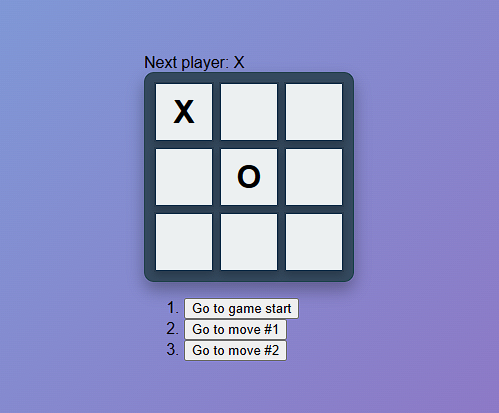

# 🎮 Nama Proyek: Tic Tac Toe

Selamat datang di proyek **Tic Tac Toe**! Nikmati permainan klasik ini dengan antarmuka yang modern dan interaktif.

✨ **Coba aplikasi Tic Tac Toe secara langsung melalui tautan berikut:**

[](https://tictactoe-hasan.netlify.app/)

## 📸 Screenshot

Lihat tampilan aplikasi kami di bawah ini:



## 🚀 Cara Menggunakan

Ikuti langkah-langkah berikut untuk menjalankan aplikasi di lokal Anda:

1. **Clone repository ini:**
   ```bash
   git clone https://github.com/MHasanBas/tic-tac-toe.git
   ```
2. **Masuk ke direktori proyek:**
   ```bash
   cd tic-tac-toe
   ```
3. **Install dependencies:**
   ```bash
   npm install
   ```
4. **Jalankan aplikasi:**
   ```bash
   npm start
   ```

Nikmati permainan dan semoga Anda menang! 🎉
